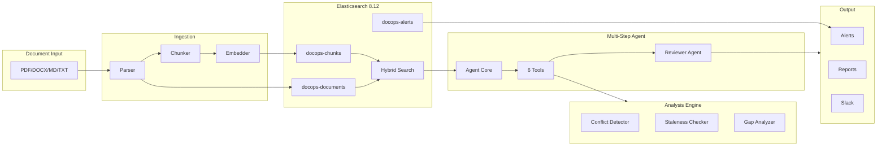
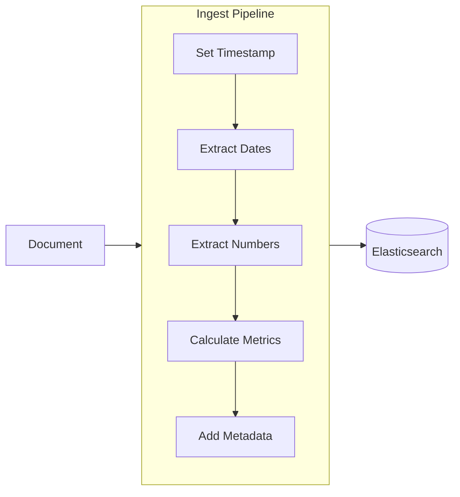

# DocOps Agent

**Intelligent Document Operations Platform with Multi-Step AI Reasoning**

> Built for the Elasticsearch Agent Builder Hackathon 2026

---

## What is DocOps Agent?

DocOps Agent is an AI-powered document analysis platform that automatically detects **conflicts, staleness, and coverage gaps** across corporate document corpuses. Unlike simple search tools, DocOps uses **multi-step reasoning** to chain multiple analysis tools together, providing comprehensive insights in seconds.

### The Problem

Organizations maintain hundreds of policy documents that frequently contradict each other:
- Security Policy says passwords must be **14 characters**
- Employee Handbook says passwords must be **12 characters**
- Which one is correct?

Manual audits take weeks. DocOps Agent does it in **2 minutes**.

---

## Why DocOps is Different

Most document analysis tools use simple pattern matching. DocOps uses **LLM reasoning** to find conflicts that require UNDERSTANDING.

| Feature | Rule-Based Tools | DocOps Agent |
|---------|-----------------|--------------|
| Numeric conflicts (12 vs 14) | YES | YES |
| Date conflicts (2024 vs 2025) | YES | YES |
| Keyword contradictions | YES | YES |
| **Semantic conflicts** | NO | **YES** |
| **Implication analysis** | NO | **YES** |
| **Multi-step reasoning** | NO | **YES** |
| **Edge case detection** | NO | **YES** |

### The Semantic Difference

**Rule-based tools miss this:**
- Remote Work Policy: *"Employees may work from any location"*
- Data Security Policy: *"Customer PII must only be accessed from secure office locations"*

There's no keyword conflict. But an employee working remotely on customer data **cannot comply with both policies**.

DocOps catches this because it **understands** the implication, not just the words.

---

## Architecture Overview



<details>
<summary><b>ASCII Diagram (for DevPost compatibility)</b></summary>

```
                                 DocOps Agent Architecture
=====================================================================================================

  +------------------+     +-------------------------+     +---------------------------+
  |  DOCUMENT INPUT  |     |    INGESTION PIPELINE   |     |    ELASTICSEARCH 8.12     |
  |------------------|     |-------------------------|     |---------------------------|
  |  - PDF           |     |  Parser                 |     |  docops-documents (BM25)  |
  |  - DOCX          | --> |    |                    | --> |  docops-chunks (kNN)      |
  |  - Markdown      |     |  Chunker                |     |  docops-alerts            |
  |  - Text          |     |    |                    |     |                           |
  +------------------+     |  Embedder (384-dim)     |     |  Hybrid Search Engine     |
                           +-------------------------+     +-------------+-------------+
                                                                         |
                                                                         v
+---------------------------+     +---------------------------+     +---------------------------+
|      OUTPUT LAYER         |     |    MULTI-STEP AGENT       |     |    ANALYSIS ENGINE        |
|---------------------------|     |---------------------------|     |---------------------------|
|  Alerts (4 severities)    | <-- |  1. Analyze Query         | <-- |  Conflict Detector        |
|  Reports (MD/Excel/PDF)   |     |  2. Select Tools (6)      |     |  Staleness Checker        |
|  Slack Notifications      |     |  3. Execute & Verify      |     |  Gap Analyzer             |
+---------------------------+     |  4. Reviewer Agent        |     +---------------------------+
                                  |  5. Synthesize Response   |
                                  +---------------------------+

=====================================================================================================
                                        9 Agent Tools:
   search_documents | compare_sections | run_consistency_check | generate_report | create_alert | get_document_health
                    detect_semantic_conflicts | get_remediation_suggestion | verify_resolution
=====================================================================================================
```

</details>

> For the full detailed architecture diagram, see [docs/architecture.md](docs/architecture.md)

---

## Key Features

### 1. Multi-Step Agent Reasoning
The agent chains multiple tools to answer complex questions:
```
User: "Are there any password policy conflicts?"

Agent Steps:
  1. search_documents → Find password-related sections
  2. run_consistency_check → Detect numeric conflicts
  3. create_alert → Flag critical issues

Result: Found 2 conflicts (12 chars vs 14 chars, 90 days vs 60 days)
```

### 2. Conflict Detection
- Detects numeric contradictions (e.g., different password lengths)
- Identifies policy inconsistencies across documents
- Severity classification (Critical, High, Medium, Low)

### 3. Staleness Analysis
- Finds expired documents with past dates
- Detects outdated year references
- Flags documents overdue for review

### 4. Coverage Gap Analysis
- Identifies topics covered inconsistently
- Finds missing sections in related documents
- Suggests documentation improvements

### 5. Automated Workflows
Pre-built workflows for common operations:
- `conflict_scan` - Full corpus conflict detection
- `staleness_audit` - Document freshness check
- `gap_analysis` - Coverage completeness review
- `compliance_audit` - Comprehensive health check

---

## Tech Stack

| Component | Technology |
|-----------|------------|
| Search & Storage | Elasticsearch 8.12 (Hybrid BM25 + Vector) |
| Embeddings | sentence-transformers/all-MiniLM-L6-v2 (384 dim) |
| Backend API | FastAPI |
| Frontend | Streamlit |
| Document Parsing | PyMuPDF, python-docx, markdown |

---

## Quick Start

### Prerequisites
- Python 3.11+
- Docker & Docker Compose
- 4GB RAM minimum

### 1. Clone and Install

```bash
git clone https://github.com/novalis133/docops-agent.git
cd docops-agent
pip install -r requirements.txt
```

### 2. Start Elasticsearch

```bash
docker-compose up -d
```

Wait for Elasticsearch to be healthy:
```bash
curl http://localhost:9200/_cluster/health
```

### 3. Setup Indices and Seed Data

```bash
python scripts/setup_elasticsearch.py
python scripts/seed_demo_data.py --ingest
```

### 4. Run the Application

**Terminal 1 - API Backend:**
```bash
python -m uvicorn src.api.routes:app --port 8000
```

**Terminal 2 - Frontend:**
```bash
python -m streamlit run frontend/app.py
```

### 5. Open Browser

Navigate to: **http://localhost:8501**

---

## Demo Walkthrough

### Step 1: Dashboard
View corpus health at a glance:
- Health score (0-100)
- Document and chunk counts
- Open alerts by severity

### Step 2: Agent Chat
Ask natural language questions:
- "Check for conflicts about password requirements"
- "Are any documents expired?"
- "What coverage gaps exist?"

Watch the **step trace** showing multi-tool reasoning.

### Step 3: Conflict Viewer
See conflicts side-by-side:
- Document A: "12 characters"
- Document B: "14 characters"
- One-click alert creation

### Step 4: Reports
Generate downloadable reports:
- Conflict Analysis (Markdown/PDF)
- Staleness Report
- Compliance Audit

---

## Project Structure

```
docops-agent/
├── src/
│   ├── ingestion/          # Document parsing, chunking, indexing
│   │   ├── parser.py       # PDF, DOCX, MD, TXT parsing
│   │   ├── chunker.py      # Section-aware chunking
│   │   ├── embedder.py     # Vector embeddings
│   │   └── indexer.py      # Elasticsearch operations
│   │
│   ├── analysis/           # Intelligence layer
│   │   ├── conflict_detector.py   # Find contradictions
│   │   ├── staleness_checker.py   # Find outdated docs
│   │   ├── gap_analyzer.py        # Find coverage gaps
│   │   └── entity_extractor.py    # Extract dates, amounts, etc.
│   │
│   ├── agent/              # Multi-step reasoning
│   │   ├── tools.py        # 6 agent tools
│   │   ├── agent_core.py   # Main reasoning loop
│   │   ├── workflows.py    # Pre-defined workflows
│   │   └── prompts.py      # System prompts
│   │
│   ├── actions/            # Output generation
│   │   ├── report_generator.py  # Markdown/PDF reports
│   │   ├── alert_manager.py     # Alert lifecycle
│   │   └── dashboard.py         # Kibana export
│   │
│   └── api/                # REST API
│       ├── routes.py       # FastAPI endpoints
│       └── schemas.py      # Pydantic models
│
├── frontend/
│   └── app.py              # Streamlit UI
│
├── scripts/
│   ├── setup_elasticsearch.py  # Index creation
│   └── seed_demo_data.py       # Demo documents
│
└── demo_docs/              # Sample documents with planted conflicts
```

---

## API Endpoints

| Endpoint | Method | Description |
|----------|--------|-------------|
| `/health` | GET | Corpus health status |
| `/search` | POST | Hybrid document search |
| `/ingest` | POST | Upload and index document |
| `/agent/chat` | POST | Multi-step agent query |
| `/agent/workflow` | POST | Execute workflow |
| `/agent/tools` | GET | List available tools |

---

## Agent Tools

| Tool | Description |
|------|-------------|
| `search_documents` | Hybrid search (BM25 + vector) |
| `compare_sections` | Compare two sections for conflicts |
| `run_consistency_check` | Scan for contradictions |
| `generate_report` | Create structured reports |
| `create_alert` | Flag issues for attention |
| `get_document_health` | Corpus health metrics |
| `detect_semantic_conflicts` | LLM-powered semantic conflict detection |
| `get_remediation_suggestion` | Get fix suggestions for conflicts |
| `verify_resolution` | Verify that a conflict has been resolved |

---

## Sample Queries

```
"What is the password policy?"
→ Uses: search_documents

"Are there any conflicts about password requirements?"
→ Uses: search_documents → run_consistency_check → create_alert

"Generate a compliance report"
→ Uses: get_document_health → generate_report

"Check if any documents are expired"
→ Uses: get_document_health → generate_report

"Find semantic conflicts about remote work and data access"
→ Uses: detect_semantic_conflicts → create_alert → get_remediation_suggestion
```

---

## Validation Results

| Component | Status |
|-----------|--------|
| Elasticsearch Connectivity | PASS |
| Data Ingestion Pipeline | PASS |
| Hybrid Search | PASS |
| Conflict Detection | PASS (2 conflicts found) |
| Staleness Detection | PASS (5 issues found) |
| Gap Analysis | PASS (27 gaps found) |
| Agent Multi-Step | PASS (3 tools chained) |
| Semantic Detection | PASS (LLM + heuristic fallback) |
| Remediation Lifecycle | PASS (4 stages) |
| Workflows | PASS (5 workflows) |
| API Endpoints | PASS |
| Frontend | PASS |

---

## Why DocOps Agent?

### For the Elasticsearch Hackathon

1. **Multi-Step Reasoning**: The agent doesn't just search—it chains tools to solve complex problems
2. **Elasticsearch-Native**: Built on hybrid search (BM25 + kNN vectors)
3. **Real-World Problem**: Document conflicts cost organizations millions in compliance failures
4. **Production-Ready**: Complete with API, frontend, alerts, and reports

### Innovation Highlights

- **Intent-Based Routing**: Agent determines which tools to use based on query intent
- **Step Trace Visualization**: Users see exactly how the agent reasons
- **Automated Workflows**: One-click compliance audits
- **Side-by-Side Conflicts**: Visual diff for document contradictions

---

## Technical Deep Dive: Advanced Elasticsearch Features

This section demonstrates mastery of Elasticsearch beyond basic search.

### 1. Ingest Pipelines for Auto-Enrichment

Documents are automatically enriched on ingestion using custom ingest pipelines:

```
PUT _ingest/pipeline/docops-documents-enrichment
```



**Processors:**
- **Date Extraction**: Regex patterns find ISO dates and year references for staleness detection
- **Numeric Requirements**: Extracts patterns like "12 characters", "30 days", "$500" for conflict hints
- **Content Metrics**: Calculates word count, reading time, complexity indicators

### 2. Runtime Fields for Dynamic Calculations

Instead of re-indexing, we use runtime fields for real-time staleness scoring:

```json
{
  "runtime": {
    "days_since_indexed": {
      "type": "long",
      "script": "emit((now - indexed_at) / 86400000)"
    },
    "staleness_risk": {
      "type": "keyword",
      "script": "if (days > 365) emit('critical'); ..."
    }
  }
}
```

**Benefits:**
- No re-indexing required when business logic changes
- Calculations always reflect current time
- Searchable and aggregatable like stored fields

### 3. Advanced Aggregations for Analytics

```json
POST docops-documents/_search
{
  "size": 0,
  "aggs": {
    "conflicts_over_time": {
      "date_histogram": { "field": "created_at", "calendar_interval": "week" }
    },
    "staleness_distribution": {
      "terms": { "field": "staleness_risk" }
    },
    "doc_type_health": {
      "terms": { "field": "file_type" },
      "aggs": {
        "avg_age": { "avg": { "field": "days_since_indexed" } },
        "severity_breakdown": { "terms": { "field": "severity" } }
      }
    },
    "significant_terms": {
      "significant_text": { "field": "content", "min_doc_count": 2 }
    }
  }
}
```

**Aggregation Types Used:**
- `date_histogram`: Trend analysis over time
- `terms` + nested: Multi-level drill-down
- `significant_text`: Find unusual terms in conflicted documents
- `avg`, `sum`, `cardinality`: Statistical metrics
- Runtime fields in aggregations: Dynamic calculations

### 4. Elasticsearch Watcher for Automation

Automated monitoring without external schedulers:

```json
PUT _watcher/watch/docops-new-document-scan
{
  "trigger": { "schedule": { "interval": "5m" } },
  "input": {
    "search": {
      "body": { "query": { "range": { "indexed_at": { "gte": "now-5m" } } } }
    }
  },
  "condition": { "compare": { "ctx.payload.hits.total.value": { "gt": 0 } } },
  "actions": {
    "webhook": {
      "url": "http://localhost:8000/agent/workflow",
      "body": "{\"workflow\": \"conflict_scan\"}"
    }
  }
}
```

**Watcher Automations:**
- New document ingestion triggers conflict scan
- Daily staleness audit at 6 AM
- Alert on critical severity thresholds

### 5. Hybrid Search Architecture

```
Query: "password requirements"
         │
         ▼
┌─────────────────────────────────────┐
│         Hybrid Search               │
├──────────────┬──────────────────────┤
│   BM25       │    kNN Vector        │
│   (0.7)      │      (0.3)           │
├──────────────┼──────────────────────┤
│ Exact term   │ Semantic similarity  │
│ matching     │ 384-dim vectors      │
└──────────────┴──────────────────────┘
         │
         ▼
    Ranked Results
```

**Configuration:**
- `dense_vector` field type with cosine similarity
- Weights tuned for policy documents (BM25 higher for exact terms)
- `num_candidates` set to 10x `k` for better recall

### 6. API Endpoints for Analytics

| Endpoint | Method | ES Features Used |
|----------|--------|------------------|
| `/analytics` | GET | Runtime fields, nested aggs, significant_text |
| `/analytics/trends` | GET | Range filters, period comparison |
| `/analytics/hotspots` | GET | Terms agg, bucket sort, risk scoring |

### Setup Commands

```bash
# Setup advanced ES features
python scripts/setup_advanced_es.py --host localhost --port 9200

# Verify setup
curl "localhost:9200/_ingest/pipeline/docops-*"
curl "localhost:9200/_watcher/watch/docops-*"
```

---

## License

MIT License

---

*DocOps Agent: Because your documents shouldn't contradict each other.*
