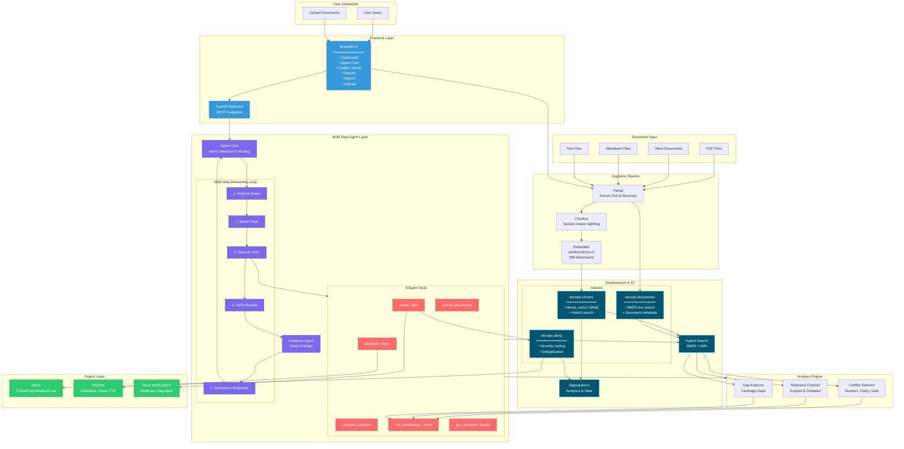

# DocOps Agent - Architecture

## System Architecture Diagram



## Component Details

### 1. Document Ingestion Pipeline

| Component | Technology | Purpose |
|-----------|------------|---------|
| Parser | PyMuPDF, python-docx | Extract text from various formats |
| Chunker | Custom | Section-aware text splitting |
| Embedder | sentence-transformers | Generate 384-dim vectors |

### 2. Elasticsearch Storage

| Index | Content | Search Type |
|-------|---------|-------------|
| docops-documents | Full documents, metadata | BM25 text search |
| docops-chunks | Text chunks + embeddings | Hybrid (BM25 + kNN) |
| docops-alerts | Alerts with deduplication | Filtered queries |

### 3. Multi-Step Agent

The agent follows this reasoning loop for each query:

```
User Query
    ↓
[1] Analyze Intent (conflict? staleness? search?)
    ↓
[2] Select Tools (1-4 tools based on intent)
    ↓
[3] Execute Tools (search → analyze → alert)
    ↓
[4] Verify Results (Reviewer Agent confirms findings)
    ↓
[5] Synthesize Response (combine results + suggestions)
    ↓
Final Answer + Step Trace
```

### 4. Agent Tools

| Tool | Purpose | ES Operations |
|------|---------|---------------|
| search_documents | Find relevant content | Hybrid search |
| compare_sections | Compare two sections | Multi-get |
| run_consistency_check | Detect conflicts | Aggregations |
| generate_report | Create reports | Full scan |
| create_alert | Flag issues | Index + Slack |
| get_document_health | Corpus metrics | Aggregations |

### 5. Analysis Engine

- **Conflict Detector**: Finds numeric, policy, and date contradictions
- **Staleness Checker**: Identifies expired/outdated documents
- **Gap Analyzer**: Discovers coverage gaps across documents

### 6. Output Formats

- **Alerts**: Indexed in Elasticsearch, sent to Slack
- **Reports**: Markdown, Excel, PDF exports
- **Dashboard**: Real-time metrics and visualizations
